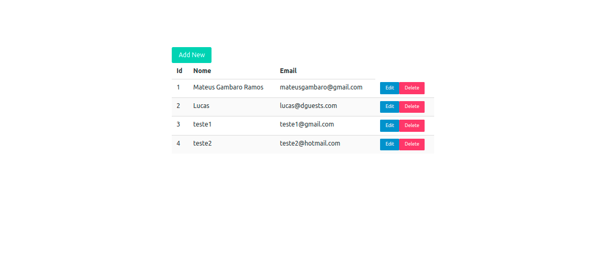
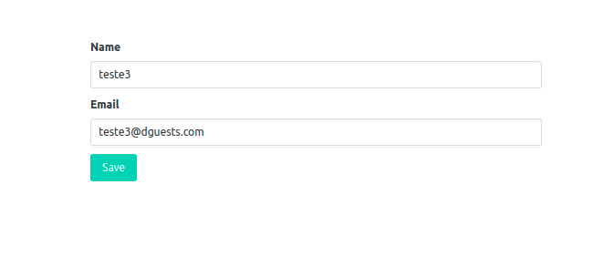
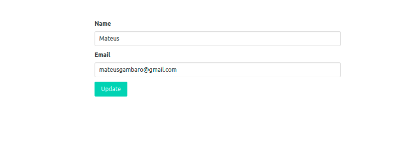
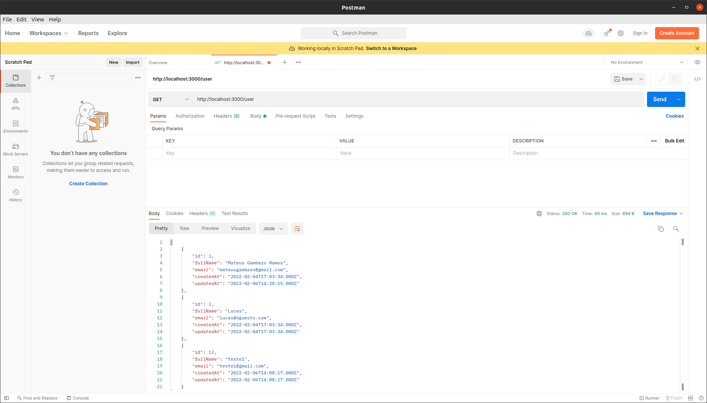
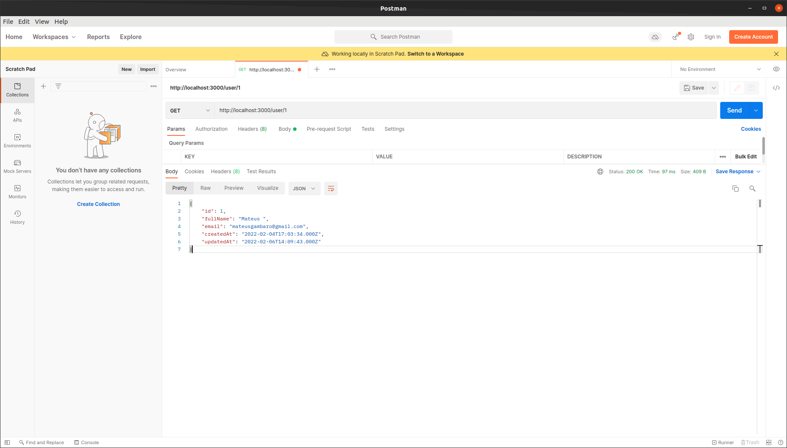

# 📦 Crud API

Criação de uma API Crud utilizando React.js | Node.js | MySQL | Docker | Heroku 

Frontend: https://dguests-crud.herokuapp.com/
Backend: https://dguests-database.herokuapp.com/

## 🛠️ Construído com

* [Sequelize](https://www.npmjs.com/package/sequelize) - Promise-based Node.js ORM for MySQL
* [Express](https://expressjs.com/) - Web framework for Node.js
* [Axios](https://axios-http.com/docs/intro) - Promise based HTTP
* [Bulma](https://bulma.io/) - CSS framework
* [Heroku](https://heroku.com/) - Platform as a Service
* [Supabase](https://supabase.com/) - Postgres database

## :man: Lista de usuários rodando na porta :3001

## :no_good_man: Adicionar usuário | http://localhost:3001/add

## :raising_hand_man: Editar usuário | http://localhost:3001/user/{id}

## :man_astronaut: /GET /POST /DELETE users | POSTMAN rodando em http://localhost:3000/user

## :man_astronaut: /GET /PUT | http://localhost:3001/user/{id}

